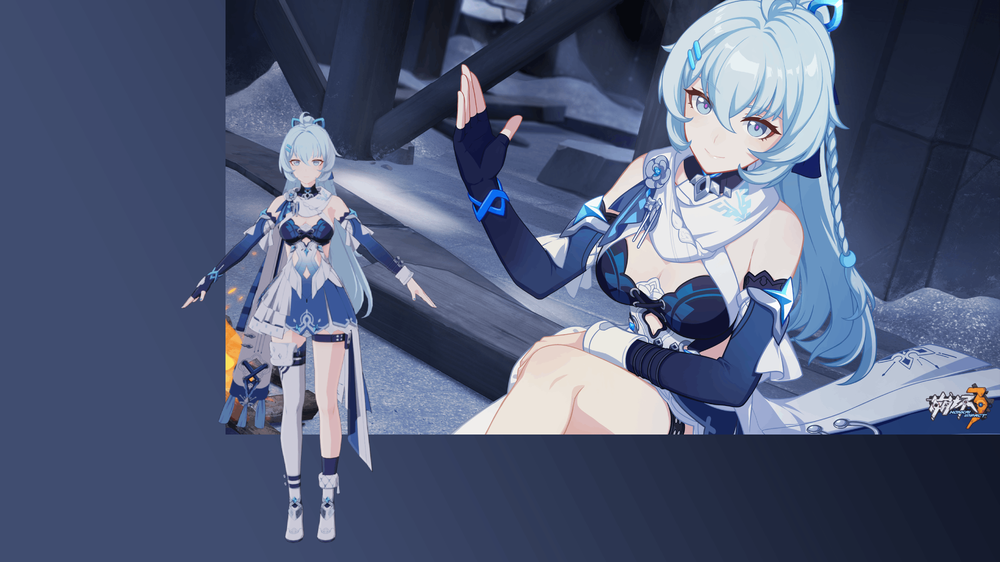

# Shigure Kira Blender Shader Preset

Tested on Blender 3.2. Modified upon [[Blender] 崩坏三格蕾修渲染展示](https://www.bilibili.com/video/BV1eA4y1o7rF/). Suitable for datamined `.fbx` models instead of MMD ones.

### Known Issue

- The color of edges of the body skin cannot be seperated from the clothes.
- Some edges are broken around the hair.
- Lack of ingame model rendering as the reference.
