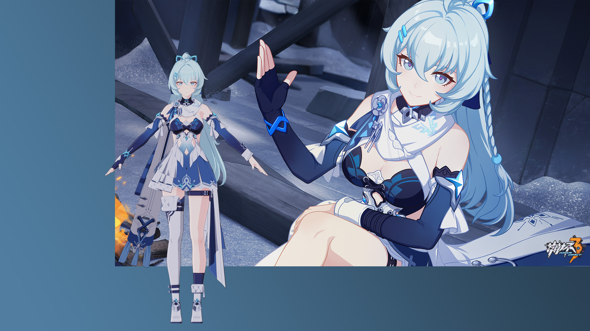

# A Shigure Kira HI3 Blender Shader Preset

A Shigure Kira Blender Shader Preset for a dead game.

Developed on Blender 3.2, and modified upon [崩坏三渲染预设——格蕾修丨小二今天吃啥啊丨爱发电 (afdian.net)](https://afdian.net/p/7bde3106e7cf11ecab9452540025c377), making it suitable for datamined `.fbx` models instead of `.pmx` MMD ones.

### Known Issues

- The color of edges of the body skin cannot be seperated from the clothes.
- Some edges are broken around the hair.
- Haven't made a seperate shader for the metal accessories yet.
- The specular light of her eyes and the highlight for her hair has not been made yet.
- The armatures for the shadow of her hair, face, upper body, and lower body can only be seperatly rotated for now.
- Lack of ingame model rendering as the reference.

### To Do (or Maybe Not If I Don't Have Time, Energy, and Mood)

- Fix the edges.
- Re-organize the nodetree since it's so messy.
- Make a shader for the metal part.
- Fix the specular and highlight.
- Pull for her supply since I already have 90k+ crystals.

### Acknowledgement

Thank the following:

- [小二今天吃啥啊的所有作品集 | 爱发电 (afdian.net)](https://afdian.net/a/xiaoer/album) for their remarkable Genshin blender presets. (Too bad that no one cares about a dead game).
- [festivize/Blender-miHoYo-Shaders: Shaders for Blender attempting to replicate the shading of games developed by miHoYo. These are for datamined assets, not custom-made ones nor the MMD variants. (github.com)](https://github.com/festivize/Blender-miHoYo-Shaders) for their pioneer works in the opensourced Genshin shaders, though I have not used their works and hope that they can release the shader for a certain dead game in the future.
- [blender用虚拟灯光向量做出崩坏三展示柜阴影随相机视角变化效果](https://www.bilibili.com/video/BV1ua4y1M7v2) whose shader is even better but I have not taken a look yet.
